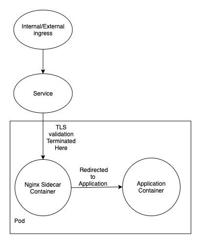

# Securing Backend Communications

## Using TLS validation on nginx sidecar

Validating TLS on the nginx sidecar is a straightforward way of adding TLS to your application. In this method, The TLS validations is done on the nginx container and the user is redirected to the application once validated.



You will need a ingress which points to the Service created. You can use this guide on [retrieving a certificate for external service](https://ukhomeoffice.github.io/application-container-platform/how-to-docs/index.html#as-a-developer-i-want-to-retrieve-a-certificate-for-my-external-service).

You will also need a network policy. You can use this guide to [create a Network Policy](https://github.com/UKHomeOffice/application-container-platform/blob/master/docs/how-to-docs/network-policies.md).

The Service for the pod should point to the port of the nginx container:

```yaml
apiVersion: v1
kind: Service
metadata:
  name: <app_name>-service
spec:
  ports:
    - name: https
      port: <nginx_port>
  selector:
    name: <app_name>
```

The deployment file for your pod will need to contain your application, as well as the [nginx-proxy image](https://quay.io/repository/ukhomeofficedigital/nginx-proxy).

```yaml
apiVersion: apps/v1
kind: Deployment
metadata:
  name:  <app_name>
spec:
  replicas: 1
  selector:
    name:  <app_name>
  template:
    metadata:
      labels:
        name:  <app_name>
    spec:
      volumes:
       - name: bundle
         configMap:
           name: bundle
      containers:
        - name: app
          image: <app_image>
        - name: nginx-proxy
          image: quay.io/ukhomeofficedigital/nginx-proxy:v3.4.20
          env:
              # The HTTPS port that Nginx-proxy is listening on
            - name: HTTPS_LISTEN_PORT
              value: <nginx_port>
              # Deletes the default rules file when set to false
            - name: NAXSI_USE_DEFAULT_RULES
              value: "FALSE"
              #  Removes port from http Host header
            - name: PORT_IN_HOST_HEADER
              value: "FALSE"
              # The upstream host you want nginx to proxy
            - name: PROXY_SERVICE_HOST
              value: 127.0.0.1
              # The port of the upstream host
            - name: PROXY_SERVICE_PORT
              value: <app_port>
              # The SSL CIPHERS supported
            - name: SSL_CIPHERS
              value: ECDHE-RSA-AES128-GCM-SHA256:AES256+EECDH:AES256+EDH:!aNULL
          ports:
            - name: https
              containerPort: <nginx_port>
          volumeMounts:
            - name: bundle
              mountPath: /etc/ssl/certs
              readOnly: true
```

For a working example of a application using TLS validation, you can look at the [Kube Example App repo](https://github.com/UKHomeOffice/kube-example-app).

## Using mutual TLS
